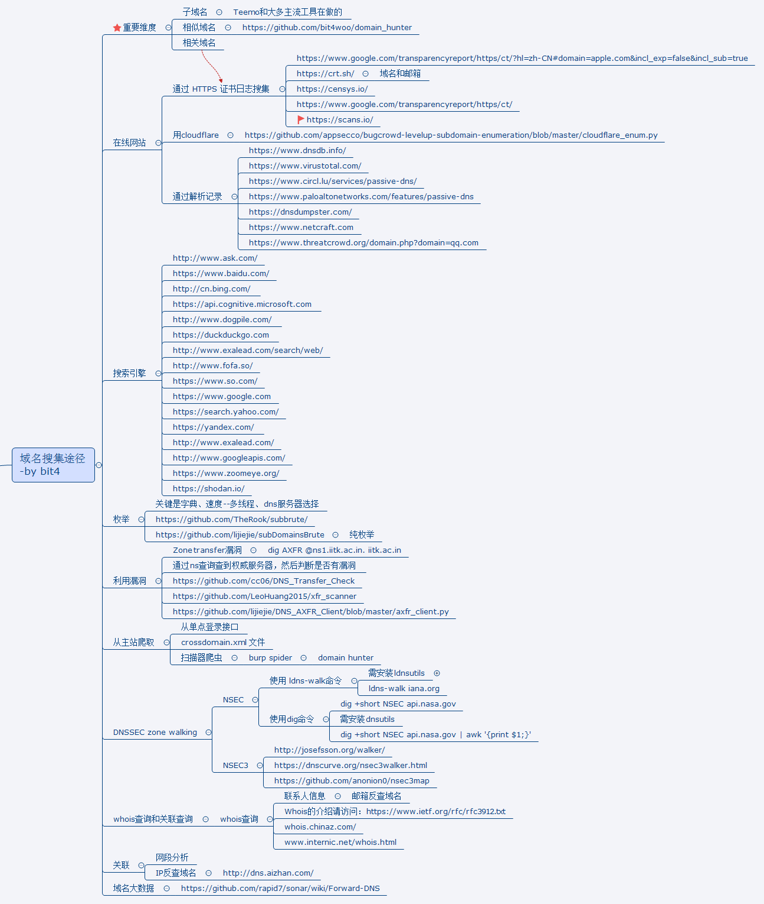

## About teemo 

项目地址：https://github.com/bit4woo/teemo

域名收集及枚举工具

提莫(teemo)是个侦察兵，域名的收集如同渗透和漏洞挖掘的侦察，故命名为提莫（Teemo）！


特色：具有相关域名搜集能力，即会收集当前域名所在组织的其他域名。原理是通过证书中"Subject Alternative Name"的内容。

相信这部分功能和 [domain_hunter](https://github.com/bit4woo/domain_hunter) 中类似域名的收集一样有用！


该工具主要有三大模块：


利用搜索引擎：
- http://www.ask.com/ （无请求限制，需要代理）
- https://www.baidu.com/ （无请求限制，不需要代理）
- http://cn.bing.com/
- https://api.cognitive.microsoft.com （bing API 尚未完成）
- http://www.dogpile.com/ （无需代理）
- https://duckduckgo.com （尚未完成，页面控制）
- http://www.exalead.com/search/web/
- http://www.fofa.so/ （需要购买）
- https://www.so.com/
- https://www.google.com （可能被block，需要代理）
- https://search.yahoo.com/
- https://yandex.com/ （可能被block）
- http://www.exalead.com/ （可能被block）
- http://www.googleapis.com/ （需要API key，google CSE）
- https://www.zoomeye.org/
- https://shodan.io/

利用第三方站点：

1. Alexa
2. Chaxunla
3. CrtSearch
4. DNSdumpster
5. Googlect
6. Ilink
7. Netcraft
8. PassiveDNS
9. Pgpsearch
10. Sitedossier
11. ThreatCrowd
12. Threatminer
13. Virustotal
14. HackerTarget

whois查询及反向查询(接口需付费,暂未加入到主功能当中)：

1. https://www.whoxy.com/
2. DOMAINTOOLS
3. WHOISXMLAPI
4. ROBOWHOIS
5. ZIPWHOIS

利用枚举

- subDomainsBrute [https://github.com/lijiejie/subDomainsBrute](https://github.com/lijiejie/subDomainsBrute)


## 各API申请指引(非必要)

其中部分接口需要API Key，如果有相应账号，可以在config.py中进行配置，**<u>没有也不影响程序的使用</u>**。

Google CSE(自定义搜索引擎):
- 创建自定义的搜索引擎（CSE）https://cse.google.com/cse/all
- 申请API Key: https://developers.google.com/custom-search/json-api/v1/overview

Bing API:
- https://azure.microsoft.com/zh-cn/try/cognitive-services/my-apis/
- https://api.cognitive.microsoft.com/bing/v5.0/search
- https://docs.microsoft.com/en-us/azure/cognitive-services/bing-web-search/quick-start

Fofa:
- 需要购买会员

Shodan:
- 登陆后页面右上角“show API key”


## 基本使用

运行环境：python 2.7.*

* 查看帮助:

```python teemo.py -h```

* 枚举指定域名（会使用搜索引擎和第三方站点模块）:

``python teemo.py -d example.com``

* 使用代理地址（默认会使用config.py中的设置）:

``python teemo.py -d example.com -x "http://127.0.0.1:9999"``

* 启用枚举模式:

``python teemo.py -b -d example.com``

* 将结果保存到指定文件(默认会根据config.py中的设置保存到以域名命名的文件中):

``python teemo.py -d example.com -o result.txt``


## 参考

参考以下优秀的工具修改而来:

- [https://github.com/ring04h/wydomain](https://github.com/ring04h/wydomain) 
- [https://github.com/aboul3la/Sublist3r](https://github.com/aboul3la/Sublist3r)
- [https://github.com/laramies/theHarvester](https://github.com/laramies/theHarvester)

Thanks for their sharing.

## Change Log

2017-08-17 : Update "domainsite" part, use logging to output; fix some bug.
2017-09-08 : Remove port scan function,leave it to nmap, add IP and Network analysis.
2018-04-03 : Add HackerTarget API
2018-04-04 : Add Censys API; Add function that to get "Related Domains" which base on Censys,Crt.sh and GoogleCert.

## To Do

- 优化DNS查询部分，抽象成一个函数
- 模糊匹配，例如包含"qq"的所有域名，比如qqimg.com
- 文件搜索


## 相关思维导图


## 免责声明

作者公开该工具代码，出于技术分享的目的，请不要用于非法用途。
任何使用该工具及代码，或者修改后的工具及代码，造成的任何问题，与本作者无关，特此声明！！！