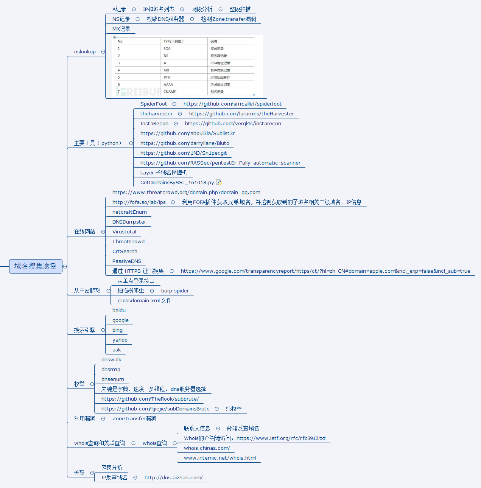

##About teemo 

域名收集及枚举工具

提莫(teemo)是个侦察兵，域名的收集如同渗透和漏洞挖掘的侦察，故命名为提莫（Teemo）！


该工具主要有三大模块：


利用搜索引擎：
- http://www.ask.com/（无请求限制，需要代理）
- https://www.baidu.com/（无请求限制，不需要代理）
- http://cn.bing.com/  （使用cn.bing.com）
- https://api.cognitive.microsoft.com （bing API 尚未完成）
- http://www.dogpile.com/ （无需代理）
- https://duckduckgo.com （尚未完成，页面控制）
- http://www.exalead.com/search/web/
- http://www.fofa.so/
- https://www.so.com/
- google (需要代理，可能被block)
- yahoo
- https://yandex.com/ （可能被block,替代方案xml.yandex.com）
- exaland (可能被block)
- googleCSE (需要API key)
- zoomeye.org
- shodan.io
- fofa.so

利用第三方站点：

- Alex
- Chaxunla (图形验证码)
- netcraft 
- DNSDumpster
- Virustotal
- ThreatCrowd
- CrtSearch
- PassiveDNS
- GooglCT
- ILink
- sitedossier
- threatminer
- Pgpsearch

利用枚举

- subbrute [https://github.com/TheRook/subbrute](https://github.com/TheRook/subbrute)

##各API申请指引
其中部分接口需要API Key，如果有相应账号，可以在config.py中进行配置，没有也不影响程序的使用

Google CSE(自定义搜索引擎):
- 创建自定义的搜索引擎（CSE）https://cse.google.com/cse/all
- 申请API Key: https://developers.google.com/custom-search/json-api/v1/overview

Bing API:
- https://azure.microsoft.com/zh-cn/try/cognitive-services/my-apis/
- https://api.cognitive.microsoft.com/bing/v5.0/search
- https://docs.microsoft.com/en-us/azure/cognitive-services/bing-web-search/quick-start

Fofa:
- 需要购买会员

Shodan:
- 登陆后页面右上角“show API key”

##基本使用

运行环境：python 2.7.*

* 查看帮助:

```python teemo.py -h```

* 枚举指定域名（会使用搜索引擎和第三方站点模块）:

``python teemo.py -d example.com``

* 使用代理地址（默认会使用config.py中的设置）:

``python teemo.py -d example.com -x "http://127.0.0.1:9999"``

* 启用枚举模式:

``python teemo.py -b -d example.com``

* 将结果保存到指定文件(默认会根据config.py中的设置保存到以域名命名的文件中):

``python teemo.py -d example.com -o result.txt``

* 收集域名并扫描指定端口 :

``python teemo.py -d example.com -p 80,443``

##参考

参考以下优秀的工具修改而来:

- [https://github.com/ring04h/wydomain](https://github.com/ring04h/wydomain) 
- [https://github.com/aboul3la/Sublist3r](https://github.com/aboul3la/Sublist3r)
- [https://github.com/laramies/theHarvester](https://github.com/laramies/theHarvester)

Thanks for their sharing.

##优缺点

为什么要修改，相对以上优秀工具有什么优缺点？

优点：

1. 使用的搜索引擎和第三方站点更全面，经过实际测试，发现收集的域名会更多。
2. 添加了代理的支持，像google，ask等可以通过指定代理地址去访问，个人使用google较多，所以这个对我很重要。
3. 使用搜索引擎的模块，会收集邮箱地址。

缺点：

1. 初始版本，bug很多。但后续会持续更新改进。欢迎提bug。

##To Do

- 接入打码平台
- 域名有效性判断，端口扫描并记录--json格式（｛domain:{ip：127.0.0.1，ports:{80,443},cdn:{yes or no,具体是谁}}｝domain）
- 泛解析，dns轮询相关
- 优化config.py
- 模糊匹配，例如包含"qq"的所有域名，比如qqimg.com
- 搜索引擎模块，使用google hacking 搜索

##Done

- 添加多线程支持。
- 添加www.so.com 360搜索引擎
- 修复ask页面参数不正确问题
- 优化代理参数设置
- 优化正则表达式，去除以“-”开头的非法域名
- 随机请求参数，减小被block几率
- 优化搜索引擎部分参数配置
- 修复dnsdumpter访问出错问题


##相关思维导图


##免责声明

作者公开该工具代码，出于技术分享的目的，请不要用于非法用途。
任何使用该工具及代码，或者修改后的工具及代码，造成的任何问题，与本作者无关，特此声明！！！